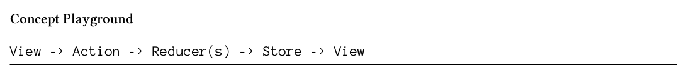

> This project was bootstrapped with [Create React App](https://github.com/facebook/create-react-app), using the [Redux](https://redux.js.org/) and [Redux Toolkit](https://redux-toolkit.js.org/) template.

| **Deployment**                                                                                                                                                                                          | **Testing**                                                                                                                                                                                                          |
| :------------------------------------------------------------------------------------------------------------------------------------------------------------------------------------------------------ | :------------------------------------------------------------------------------------------------------------------------------------------------------------------------------------------------------------------- |
| [](https://mattborghi.github.io/react-redux-intro) | [](https://github.com/mattborghi/react-redux-intro/actions/workflows/Tests.yml) |

> These notes are based on the book [Taming the State in React](https://leanpub.com/taming-the-state-in-react) by Robin Wieruch.
# Redux

**Redux** adopted a handful of constraints from the Flux architecture but not all of them. It has **Actions** that encapsulate information about the state update. It has a **Store** to save the state, too. However, the Store is a _singleton_. Thus, there are not multiple Stores like there used to be in the Flux architecture.
In addition, there is no single Dispatcher. Instead, Redux uses multiple **Reducers**. Basically, Reducers pick up the information from Actions and “reduce” it to a new state that is saved in the Store. When state in the Store is changed, the **View** can act on this by subscribing to the Store.



Why is it called Redux? Because it combines the two words Reducer and Flux. The abstract picture
should be imaginable now. The state doesn’t live in the View anymore, it is only connected to the View. What does connected mean? It is connected on two ends, because it is part of the unidirectional data flow. One end is responsible to trigger an Action to update the state, the second end is responsible to receive the state from the Store. The View can update according to state changes and can trigger state changes.
The View, in this case, would be React, but Redux could be used with any other library or standalone.
After all, it is only a state management container.

## Actions

An action in Redux is a JavaScript object. It has a type and an optional payload. The type is often
referred to as action type. While the type is a string literal, the payload can be anything.

For instance, the following action in this application can be used to add a new todo item:

```javascript
{
    type: 'TODO_ADD',
    todo: { id: '0', name: 'learn redux' },
}
```

Executing an action is called to _dispatch_ in Redux. You can **dispatch an action to alter the state in the Redux store**. You only dispatch when you want to change the state. The dispatch of an action can be triggered in your view layer. It could be as simple as a click on a button.
In addition, the **payload in a Redux action is not mandatory**. You can define actions that have only an action type. So once an action is dispatched, it will come by all reducers in Redux.

## Reducers

A reducer is the next part in the chain of the unidirectional data flow. The view dispatches an action and the action object, with action type and optional payload, will pass through all reducers.
What’s a reducer? A **reducer is a pure function**. It always produces the same output when the input stays the same. It has _no side-effects_, thus it is only an input/output operation.
A reducer has _two inputs: state and action_. The **state is always the whole state object from the Redux store**. The **action is the dispatched action with a type and an optional payload**. The reducer reduces - that explains the naming - the previous state and incoming action to a new state.

```javascript
(state, action) => newState;
```

Apart from the functional programming principle, namely that a reducer is a pure function without
side-effects, it also embraces immutable data structures. It always returns a newState object without mutating the incoming state object. Thus, the following reducer, where the state of the Todo
application is a list of todos, is **NOT** an allowed reducer function:

```javascript
function(state, action) {
    return state.push(action.todo);
}
```

It would mutate the previous state instead of returning a new state object. The following is allowed because it keeps the previous state intact:

```javascript
function reducer(state, action) {
  return state.concat(action.todo);
}
```

_Concat_ always returns a new array without mutating the old array. The data structure stays immutable.
But what about the action type? Right now, only the payload is used to produce a new state but
the action type is ignored.
When an action object arrives at the reducers, the action type can be evaluated. Only when a reducer
cares about the action type, it will produce a new state. Otherwise, it simply returns the previous
state. In JavaScript, a switch case can help to evaluate different action types or to return the previous state on default.

Imagine your Todo application would have a second action that toggles a Todo to either completed
or incomplete.

```javascript
{
    type: 'TODO_TOGGLE',
    todo: { id: '0' },
}
```

The reducer would have to act on two actions now: `TODO_ADD` and `TODO_TOGGLE`. By using a
switch case statement, you can branch into different cases. If there is not such a case, you return the unchanged state by default.

```javascript
function reducer(state, action) {
  switch (action.type) {
    case "TODO_ADD": {
      return applyAddTodo(state, action);
    }
    case "TODO_TOGGLE": {
      return applyToggleTodo(state, action);
    }
    default:
      return state;
  }
}

function applyAddTodo(state, action) {
  // keeping the action to the bare minimum
  // no need to defined completed
  const todo = Object.assign({}, action.todo, {
    completed: false,
  });
  return state.concat(todo);
}

function applyToggleTodo(state, action) {
  state.map((todo) =>
    todo.id === action.todo.id
      ? Object.assign({}, todo, { completed: !todo.completed })
      : todo
  );
}
```

`Object.assign()` returns a new object without
mutating the old object. `Object.assign()` merges all given objects from the former to the latter into each other.

Notice that these functionalities, actions and reducer, are plain JavaScript. There is no function from the Redux library involved by now. There is no hidden library magic. It is plain JavaScript with functional programming principles in mind.

## Store

- Who delegates the actions to the reducer?
- Who triggers actions?
- And finally: Where do I get the updated state to glue it to my View?

It is the Redux store. The store holds one global state object. There are no multiple stores and no
multiple states. The store is only one instance in your application. In addition, it is the first library dependency you encounter when using Redux.

```javascript
import { createStore } from "redux";
```

Now you can use it to create a store singleton instance. The createStore function takes one
mandatory argument: a reducer. In addition, it takes a second optional argument: the initial state. In the case of the Todo application, the reducer operated on a list of todos as state. The list of todo items should be initialized as an empty array or pre-filled array with todos. If it wasn’t initialized, the reducer would fail because it would operate on undefined property.

```javascript
const store = createStore(reducer, []);
```

Now you have a store instance that knows about the reducer. The Redux setup is done. However, now you want to interact with the store. You want to dispatch actions, get the state from the store
and listen to updates of the state in the store. So how to dispatch an action?

```javascript
store.dispatch({
  type: "TODO_ADD",
  todo: { id: "0", name: "learn redux", completed: false },
});
```

How to get the global state from the store?

```javascript
store.getState();
```

How to subscribe (and unsubscribe) to the store in order to listen for updates?

```javascript
const unsubscribe = store.subscribe(() => {
  console.log(store.getState());
});
// don't forget to unsubscribe eventually
unsubscribe();
```

> Keep reading in the [Wiki](https://github.com/mattborghi/react-redux-intro/wiki/)!
## Available Scripts

In the project directory, you can run:

### `npm start`

Runs the app in the development mode.<br />
Open [http://localhost:3000](http://localhost:3000) to view it in the browser.

The page will reload if you make edits.<br />
You will also see any lint errors in the console.

### `npm test`

Launches the test runner in the interactive watch mode.<br />
See the section about [running tests](https://facebook.github.io/create-react-app/docs/running-tests) for more information.

```

```
